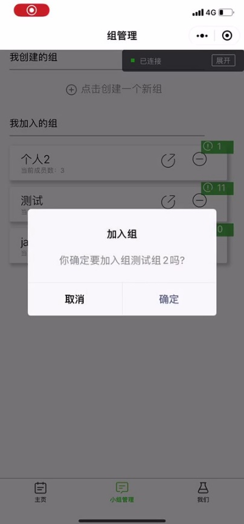

# Meeting

[TOC]

## ABOUT US

The full name of our WeChat mini program is **Meeting.**

It is a **calender** app that allows you to share events with others and some **groups of yours** with time availability check.

## FUNCTIONALITIES LIST

### As a calendar

1. Show user calendar

2. Add an event in calendar

3. Modify and delete the event in personal calendar

4. Event reminder (It will be completed when this WeChat mini program is published)

### As a group manage tool

1.    Create a group and a group calendar

2. Participate in a group

3. Quit the group (Only the member in the group)

4. Disband a group and delete the group calendar (Only the owner of the group calendar)

5. Share the group via WeChat mini program link and invite someone to participate in a group

6. Add a group event (Only the owner of the group calendar)

7. Modify and delete the group event (Only the owner of the group calendar)

8. See the group member’s personal calendar

9. Free time recommendation when adding a group event **(To be improved)**

### As a user

1.    Change group

2.    Do not disturb mode

3.    Privacy mode **(To be improved)**

4.    Modify user name 

## USER MANUAL

### Check calendar

User can view the personal event and the group event in his or her personal calendar on the daily schedule card. And you can also view the calendar of the past three days and the next six days via swiping to change schedule card.

The event will show different color according to the priority. There are four priorities for an event. Red represents priority 4. Orange represents priority 3. Blue represent priority 2. Green represents priority 1.

You can see the detail of a event by long pressing the event. The detail includes the name, start time, end time, priority, repetition and description.

### Add a new event

By clicking “add a event” button, user can add a event in his or her calendar. You should set the details of the event includes the name, start time, end time, priority, repetition and description. The event should not happen six days later and its duration should be more than 30 minutes. 

After adding, program will swipe to that event.

### Modify or delete event

The “delete” and “modify” button are placed at the bottom of the event dialog box. 

After setting the changes of this event, you can modify your event by clicking the “modify” button. 

You can delete the event by clicking the “delete” button.

You can only modify or delete the event in your personal calendar. The group event only can be modified or delete by the owner of the group calendar.

### Create a group

In the group manage page, the groups that you created and participated are placed in two parts in this page.

By clicking the “create a new group” and inputing the name of the group, you can create a new group and you are the owner of this calendar.

### Share/quit/disband a group

The “share” and “quit/disband” button are placed at the right side of the group card.

You can share the WeChat mini program link to you friends or WeChat group. 

By clinking the WeChat mini program link, you can choose whether to join the group or not. And as a member of a group, you can not modify or delete the group event.

### Add a group event

Adding a group event is similar to adding an event in personal calendar. The differences are when you add a group event the program will suggest you the common free time firstly and only the owner of the group can add a group event.

### Set do not disturb mode

If you are the owner of the calendar, the button below the calendar should be “add a event”, but if you are a member of a calendar, the button should be “do not disturb mode”. 

After setting the do not disturb mode, It will not take your schedule into consideration when the program suggest a comm free time. And after the remind functionality is completed, it will not send you a notification when a group event is added.

## SYSTEM ARCHITECTURE AND COMPONENT DESIGN

This is our architecture. We are using spring boot to build our backend. We mainly consider following aspect to design our backend.

### Security 

WeChat is closely related to everyone and it may contain lots of sensitive information. As for our program meeting, user may store some important and personal information. We mainly use https to transform information between client and server; use session key to identify user and keep connection between client and server; finally we user shiro to authorize and manage session.

shiro: is an open source software security framework; it has been designed to be an easy-to-use framework while still providing robust security features.

session key: in our back, we mainly manage two kinds of session key. One is the WeChat official session key, which is used to call WeChat API for user. The other is the session key we generate to identify user. We also set an Expiration date for it. Because they are frequently used between client and server, we store them into Redis - a key-value in memory database.

### Efficiency   

Efficiency is another important aspect. We all know when we attempt to connect database, it may cause a big overhead. When we connect databases, we use the connection pool.

HikariCP connection pool is used to connect mysql. And lettuce connection pool is used to connect redis.

We also use the Mybatis ORM Framework to generate our sql. 

### Union

One of the reasons why we developed in the WeChat mini program framework is the Ecology of WeChat. In order to create a better user experience, we use the WeChat official API to get users’ information and interact with users. 

Our backend is mainly divided into 5 parts – Controller, Service, Model, DAO and Util. **(1) Model:** The role of model bearing is the abstraction of data, describing the definition of a data, and the instance of Model is a group of data. The entire system can be seen as the flow of data. Since it is flowing, it must be a carrier of flow. Model should be a collection of pure data, which is a data cluster that is passed on by various things and processed by various processes. The data needed for this project process (this package in this article) is defined here. Which generated getter and setter methods may be summarized later.

**(2) Util**: Util is usually a tool, that is, a public method, often used to describe data processing that has nothing to do with business logic. Since it is not related to business logic, it is a plug-and-play method. It is a good thing to accumulate Util during learning. Util must have a clear input and a clear output.

 **(3) DAO**: Data access object. Simply put, it is to encapsulate the SQL statements in the Dao layer, communicate with the underlying database, and be responsible for the addition, deletion, modification of the database. Dao never cares where the data goes, he only cares about storage, removal, query and replacement. The role of Dao makes our interaction with the database look more like dealing with an object. When we manipulate this object, this object will automatically generate SQL statements to deal with the database, and we only need to deal with DAO. Of course, in essence, DAO does not need to have any necessary connection with the database. DAO is just an abbreviation of data access object, so as long as the data is persistently packaged into an object for access (read and write), such objects It can be called DAO. Dao represents the interface of the Dao layer. The factory implements the connection between the interface and the implementation class, and implement is the class that implements this interface. The required SQL code is implemented in implement.

**(4) Service**: Provide business functions. This service is "highly abstract and general", and only needs to focus on the interface given by the service. It mainly makes logical judgments and accesses the database by calling the corresponding Dao layer. So the characteristics of service: abstract, independent, stable.

**(5) Controller**: The control center, all instructions, and dispatch are issued from here. Call everything defined above, whether it is data or logic.

## DATABASE DESIGN

### Relational database – MySQL

As our main storage platform, our MySQL database has 8 tables, which are tables of *event, calendar, user, user_calendar, user_detail, event_detail, event_repetition, event_reminder.* Among them are 2 tables that are so crucial because they are converted from relationships in ER diagram. They depict various and complex relationships of user and calendars or events in terms of their roles. A user should have one personal calendar, which is represented by a row in *user_calendar* table with the role set as “mine”. A user can create a group calendar, which is represented by a row in *user_calendar* table with the role set as “owner”. A user can join a group calendar created by others, which is represented by a row in *user_calendar* table with the role set as “participant”. A user can create an event in his own personal calendar, which is represented by a row in *user_detail* table with the permission set as “owner”, meaning he can view, modify and delete the whole event. A user can create an event in a group calendar(at this point only the owner of a group can create one) , which is represented by many rows in *user_detail* table, where there is a row about creator and many rows about other group members in the group. A user can also share an event with other people(note that it’s different than the concept of group events), which is represented by a row in *user_detail* showing that the specific permission of the one who is the object of the sharing on that event. To be more specific, he can view it, of course, but doesn’t necessarily has the permission to modify it, though he can delete it only in his own calendar, not affecting the sharer.

During the sharing process, a key factor that allows the operation is that the table of *event* and *event_detail* are separated. The reason why wo do that is that we want the shared event has some different behavior while remains consistent in its detail. So, a shared event appears different in different user’s calendar in terms of reminder setting and priority level setting and essentially the same in terms of its title, content, time, etc.

Though we have implemented a feature that allows repetition set as either once a week or no repetition at all, our database design allows more actually. You can set an event repeat every day, every month, or even every 3 days, every 2 weeks because repetition information is stored according to repetition unit and amount. For example, if a user choose to set repetition as every 2 weeks, there will be a row in repetition table with unit as “week” and amount as “2”.

Considering not all events are set to remind user of repeat once in a while, we introduce a flag in tables that indicates the status of reminder setting and repetition setting, which can save some space to some extent.

### Redis

Our project uses Redis to shore key-value data, WeChat user login service related, to be more specific. When a new user logins in, backend will send a request to WeChat to get that user’s “openid”, “session_key” and backend will assign a new “userid”, which is our primary key in relational database, to the user. The 3 entries are all stored in Redis as value to the key generated by backend uuid. The next time that user logins in, the WeChat mini program will send a request to WeChat to see if its session key is expired. If not, mini program tells backend to use existing entry. Then mini program communicates with backend with uuid from last time and backend will check corresponding “userid” to tell which user is online.

You can see the “uuid” on the left and the value corresponding to that “uuid”, which contains “openid”, “session_key” and “userid”.

 

## OTHER TECHNICAL DETAILS

We use following techniques to make our program more efficient. 

### MyBatis

MyBatis is a Java persistence framework that couples objects with stored procedures or SQL statements using an XML descriptor or annotations. MyBatis is free software that is distributed under the Apache License 2.0.MyBatis is a fork of iBATIS 3.0 and is maintained by a team that includes the original creators of iBATIS. Unlike ORM frameworks, MyBatis does not map Java objects to database tables but Java methods to SQL statements. MyBatis lets you use all your database functionality like stored procedures, views, queries of any complexity and vendor proprietary features. It is often a good choice for legacy or de-normalized databases or to obtain full control of SQL execution. It simplifies coding compared to JDBC. SQL statements are executed with a single line. MyBatis provides a mapping engine that maps SQL results to object trees in a declarative way. SQL statements can be built dynamically by using a built-in language with XML-like syntax or with Apache Velocity using the Velocity integration plugin. MyBatis integrates with Spring Framework and Google Guice. This feature allows one to build business code free of dependencies. MyBatis supports declarative data caching. A statement can be marked as cacheable so any data retrieved from the database will be stored in a cache and future executions of that statement will retrieve the cached data instead hitting the database. MyBatis provides a default cache implementation based on a Java HashMap and default connectors for integrating with: OSCache, Ehcache, Hazelcast and Memcached. It provides an API to plug other cache implementations.

### Hikari

HikariCP is newer JDBC connection pool, but has already gained a large following. And for good reason! It’s lightweight, reliable, and performant. We recently added it as a core module to Mybatis ORM: Mybatis -hikaricp (will be released in ORM 4.3.6 and 5.0.0). However, I wanted to try and replace C3P0 within NeighborLink’s new web platform. It’s been plagued with connection timeouts (regardless of the many iterations of config changes) and other quirks. This setup also requires less maintenance, since rather than relying on Hibernate <-> HikariCP integration and supported versions, you sidestep that entirely and directly feed HikariCP into Spring. This should theoretically allow you to use HikariCP with any version of Spring supporting Mybatis through a SessionFactoryBean. Also note that although I’m using the annotation-based Spring configuration, the concepts would be similar through XML.

### MySQL

MySQL is an open-source relational database management system (RDBMS). Its name is a combination of "My", the name of co-founder Michael Widenius's daughter, and "SQL", the abbreviation for Structured Query Language. MySQL is free and open-source software under the terms of the GNU General Public License, and is also available under a variety of proprietary licenses. MySQL was owned and sponsored by the Swedish company MySQL AB, which was bought by Sun Microsystems (now Oracle Corporation). In 2010, when Oracle acquired Sun, Widenius forked the open-source MySQL project to create MariaDB.MySQL is a component of the LAMP web application software stack (and others), which is an acronym for Linux, Apache, MySQL, Perl/PHP/Python. MySQL is used by many database-driven web applications, including Drupal, Joomla, phpBB, and WordPress. MySQL is also used by many popular websites, including Facebook, Flickr, MediaWiki, Twitter, and YouTube.

### Redis

Redis (Remote Dictionary Server) is an in-memory data structure project implementing a distributed, in-memory key-value database with optional durability. Redis supports different kinds of abstract data structures, such as strings, lists, maps, sets, sorted sets, HyperLogLogs, bitmaps, streams, and spatial indexes. The project is mainly developed by Salvatore Sanfilippo and as of 2019, is sponsored by Redis Labs. It is open-source software released under a BSD 3-clause license.

### Lettuce

Lettuce is a scalable thread-safe Redis client providing synchronous, asynchronous and reactive APIs. Multiple threads may share one connection if they avoid blocking and transactional operations such as BLPOP and MULTI/EXEC. Multiple connections are efficiently managed by the excellent netty NIO framework. Support for advanced Redis features such as Sentinel, Cluster, and Redis data models is included.Lettuce supports the RESP2 protocol and with this, it supports Redis 2.x up to 5.x.

### Shiro

Apache Shiro is a powerful and easy-to-use Java security framework that performs authentication, authorization, cryptography, and session management. With Shiro’s easy-to-understand API, you can quickly and easily secure any application – from the smallest mobile applications to the largest web and enterprise applications. 

Shiro provides the application security API to perform the following aspects (I like to call these the 4 cornerstones of application security):Authentication - proving user identity, often called user ‘login’; Authorization - access control; Cryptography - protecting or hiding data from prying eyes; Session Management - per-user time-sensitive state. Shiro also supports some auxiliary features, such as web application security, unit testing, and multithreading support, but these exist to reinforce the above four primary concerns.

### HTTPS

HyperText Transfer Protocol Secure (HTTPS) is an extension of the Hypertext Transfer Protocol (HTTP). It is used for secure communication over a computer network, and is widely used on the Internet. In HTTPS, the communication protocol is encrypted using Transport Layer Security (TLS) or, formerly, its predecessor, Secure Sockets Layer (SSL). The protocol is therefore also often referred to as HTTP over TLS, or HTTP over SSL.The principal motivations for HTTPS are authentication of the accessed website, protection of the privacy and integrity of the exchanged data while in transit. It protects against man-in-the-middle attacks. The bidirectional encryption of communications between a client and server protects against eavesdropping and tampering of the communication. In practice, this provides a reasonable assurance that one is communicating without interference by attackers with the website that one intended to communicate with, as opposed to an impostor.

The authentication aspect of HTTPS requires a trusted third party to sign server side digital certificates, which historically was expensive. Thus the full authenticated HTTPS connections were more commonly found only on secured payment transaction services, and other secured corporate information systems on the World Wide Web. In 2016 a non profit organisation, Let's Encrypt, began to offer free server certificates to all, and a campaign by the Electronic Frontier Foundation and support of web browser developers led to the protocol to become more prevalent. HTTPS is now used more often by web users than the original non-secure HTTP, primarily to protect page authenticity on all types of websites; secure accounts; and to keep user communications, identity, and web browsing private.

### The Mini Program

WeChat Mini Programs are a new way of connecting users and services. They are easy to access and share on WeChat, delivering an excellent user experience. The Mini Program comes with a simple and efficient app development framework and a wide range of components and APIs to help developers develop services with a native app experience in WeChat. This document introduces the Mini Program development language, framework, capabilities, debugging, and other topics, so that developers can quickly and comprehensively understand the different aspects of Mini Program development.